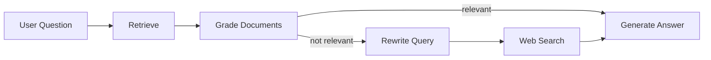

# Adaptive Customer Support Agent — Corrective-RAG 

A **Corrective RAG (CRAG)** agent that retrieves documents, grades relevance, falls back to web search, and generates answers using Google Gemini.

## How it works



## Setup

1. **Clone and install:**
   ```bash
   cd cheetah
   pip install -r requirements.txt
   ```

2. **Set your API key:**
   ```bash
   cp .env.example .env
   # Edit .env and add your GOOGLE_API_KEY
   ```
   Get a key at https://aistudio.google.com/app/apikey

3. **Add documents:**
   Place PDF, MD, or TXT files in `./docs/`.

## Usage

**Ask a single question:**
```bash
python main.py "What is your employee coverage?"
```

**Interactive mode:**
```bash
python main.py -i
```

**Use a custom document:**
```bash
python main.py --doc path/to/document.pdf "Your question"
```

**Force rebuild vector store:**
```bash
python main.py -r "Your question"
```

### Using the run script
```bash
./run.sh "Your question"
./run.sh --interactive
```

## Project structure

```
cheetah/
├── main.py          # CLI entry point
├── config.py        # API key, LLM, embeddings
├── ingestion.py     # Document loading, chunking, vector store
├── app.py           # LangGraph CRAG state machine
├── tools.py         # DuckDuckGo web search fallback
├── requirements.txt
├── run.sh
├── .env.example
└── chroma_db/       # Persistent vector store (generated)
```
