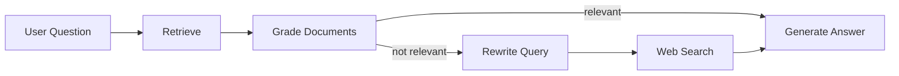

# Adaptive Customer Support Agent — Corrective-RAG 

A **Corrective RAG (CRAG)** agent that retrieves documents, grades relevance, falls back to web search, and generates answers using Google Gemini.

## How it works



## Setup

1. **Clone and install:**
   ```bash
   git clone https://github.com/Adithya-J05/Adaptive-Customer-Support-Agent---Corrective-RAG.git
   cd Adaptive-Customer-Support-Agent---Corrective-RAG
   pip install -r requirements.txt
   ```

2. **Set your API key:**
   ```bash
   cp .env.example .env
   # Edit .env and add your GOOGLE_API_KEY
   ```
   Get a key at https://aistudio.google.com/app/apikey

3. **Add documents:**
   Place PDF, MD, or TXT files in `./docs/`.

## Usage

**Ask a single question:**
```bash
python main.py "What is your employee coverage?"
```

**Interactive mode:**
```bash
python main.py -i
```

**Use a custom document:**
```bash
python main.py --doc path/to/document.pdf "Your question"
```

**Force rebuild vector store:**
```bash
python main.py -r "Your question"
```

### Using the run script
```bash
./run.sh "Your question"
./run.sh --interactive
```
## 🏗️ Core Architecture & Features

Traditional RAG systems are brittle—blindly trusting whatever the vector database returns, leading directly to hallucinations. This project implements **Corrective RAG (CRAG)** to build a self-correcting agent that actively guards against bad data.

* **Deterministic LLM Grading:** Evaluates the top-3 retrieved chunks on a strict binary scale (`yes`/`no`) at zero temperature to guarantee routing precision.
* **Dynamic Query Transformation:** If local context is missing or stale, the agent rewrites the user's natural language question into an optimized web-search query.
* **Live Internet Fallback:** Intercepts failed retrievals and fetches real-time context from the live web to answer out-of-bounds questions accurately.
* **Fully Resilient State Machine:** Built as a cyclic graph where state is safely managed, tracked, and passed through nodes without memory leaks.

---

## 🛠️ Tech Stack & Production Tools

This project is built using a **100% zero-cost, enterprise-grade open-source stack** that can run locally or in the cloud (Google Colab):

* **Orchestration:** `LangGraph` & `LangChain` (Python)
* **LLM Engine:** `Gemini 1.5 Flash` (Used for structured grading, transformation, and final generation via Google AI Studio's free tier)
* **Vector Embeddings:** `Google GenAI text-embedding-004`
* **Vector Database:** `ChromaDB` (On-disk persistent storage tracking document metadata)
* **Web Search Engine:** `DuckDuckGo Search API` (via `ddgs` package integration)
* **Data Ingestion Pipeline:** `PyPDFLoader` combined with `RecursiveCharacterTextSplitter`

---

## 📂 Project Structure

The pipeline is entirely modularized across 4 core Python files to separate concerns and allow clean parallel feature branches during development:

```text
📦 adaptive-customer-support-agent
 ┣ 📂 docs/                  # Drop your policy, FAQ, or training PDFs here
 ┣ 📜 config.py              # Environment variables, model initializations, and chunking hyperparameters
 ┣ 📜 ingestion.py           # PyPDF parsing, chunking (500 chars / 100 overlap), and ChromaDB building
 ┣ 📜 tools.py               # Custom DuckDuckGo web-scraper wrapper and structured LLM Grader logic
 ┣ 📜 app.py                 # The LangGraph StateMachine compilation, graph nodes, and routing logic
 ┗ 📜 main.py                # Command-Line Interface (CLI) parsing and interactive runtime control
```

🧭 Graph Execution Flow
When a query is submitted, the state machine orchestrates execution through 5 discrete nodes and a conditional router:

```
      [ User Query ]
            │
            ▼
     1. Retrieve Node  ◄── (Fetches Top-k=3 Chunks from ChromaDB)
            │
            ▼
  2. Grade Documents Node 
            │
    [Conditional Edge] ────► (Are documents relevant?)
            │
            ├───► YES ────► 5. Generate Node ──► [Grounded Answer]
            │
            └───► NO  ────► 3. Transform Query Node
                                    │
                                    ▼
                            4. Web Search Node (DuckDuckGo API)
                                    │
                                    ▼
                             5. Generate Node ──► [Internet-Backed Answer]


```
